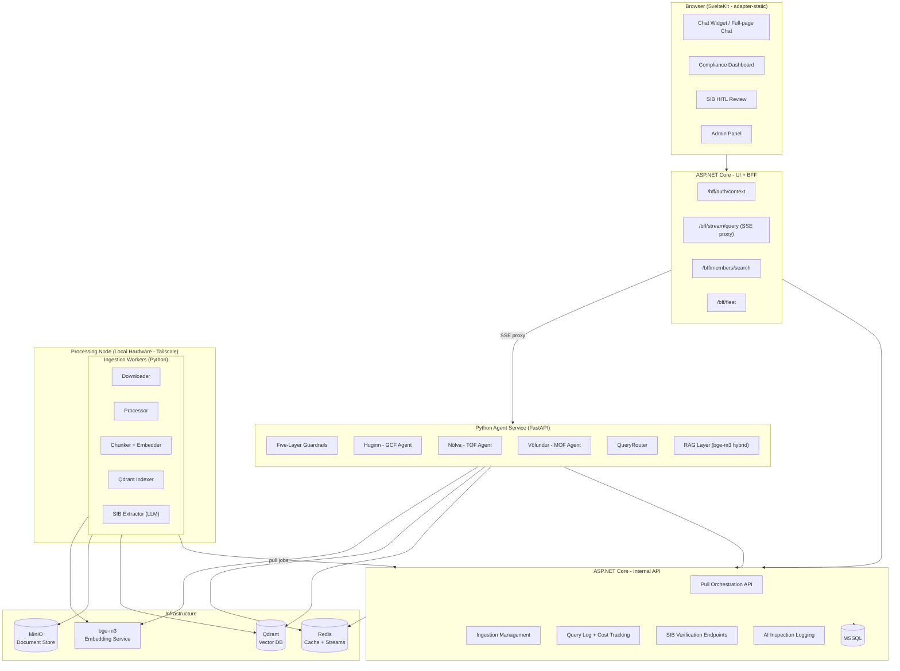

# Advanced Regulatory Aviation RAG, Pipelines and AiAgents

**Production-grade AI compliance and knowledge platform for regulated aviation organisations.**

---

## What This Is

A multilingual, multi-tenant AI platform purpose-built for glider and SPL clubs operating under EASA regulatory frameworks. It answers questions about operations, regulations, certification, and fleet compliance in Icelandic and English with full citations, explicit regulatory tier attribution, and Human-in-the-Loop verification before AI-derived compliance data becomes operationally active.

This is not a chatbot wrapper. It is a regulated-domain AI system designed around the constraint that aviation safety decisions cannot be based on hallucinated information. Every architectural choice, from the embedding model to the guardrail stack to the deployment topology, reflects that constraint.

---

## The Three Agents

The platform exposes three bounded AI agents, each scoped to a distinct organisational domain. Named from Norse mythology - intentional, memorable, and meaningful.

| Agent | Subsystem | Code | Domain | Mythology |
|---|---|---|---|---|
| **Huginn** | GlidingClubFountain | GCF | Club rules, operations, legal Q&A, member support | Odin's raven of thought - always gathering knowledge and returning with answers |
| **Nölva** | TrainingOrganizationFountain | TOF | Exam explanations, intelligent question selection, post-exam review | Root shared with Völva (Norse seeress) and Tölva (Icelandic: computer = tala + völva). An AI teaching agent in that lineage. |
| **Völundur** | MaintenanceOrganizationFountain | MOF | Fleet compliance, SIBs, ADs, applicability matching, compliance reports | The Norse master craftsman: precise, technical, keeps things airworthy |

Each **Fountain** is a complete subsystem: ingestion pipeline, Qdrant collections, retrieval layer, and agent interface. Agents share infrastructure but are scoped by collections, system prompts, and tool access.

---

## Architecture Overview



---

## What Makes This Distinctive

### 1. Pull-Based Orchestration - Built In-House, Deliberately
The ingestion pipeline is orchestrated by the C# API. Not a third-party workflow engine. Every job, every stage transition, and every retry is a row in MSSQL with a TrackingId, a timestamp, and enough context to rerun it from any point in time. The orchestration logic and the audit trail are the same thing. This gives us native multi-tenancy, full compliance-grade observability, split-deployment support (ingestion runs on local hardware for cost efficiency; the API runs on a VM), and the flexibility to retry any individual stage without touching infrastructure, all without adding an external dependency that would need its own monitoring, scaling, and failure handling.

### 2. Qdrant - Purpose-Built for This Problem
Qdrant was chosen because it natively solves the three requirements that define this system: multi-tenant collection isolation, rich metadata filtering (tier, language, club_id, document_type that are all queryable at retrieval time), and hybrid dense+sparse search in a single call. bge-m3 produces both dense and sparse vectors; Qdrant stores and queries both natively. For legal terminology where "SFCL.200(a)(1)" and "airworthiness directive" must match exactly, not approximately, sparse retrieval is not optional. Qdrant makes that a first-class feature, not a custom implementation problem.

### 3. Multilingual RAG - Translate Queries, Not Documents
Documents are indexed once in their source language. When an Icelandic user asks a question, the query is translated to English before retrieval - not the document corpus. Citations are returned verbatim in their source language. This preserves legal precision: translated regulatory text is not the authoritative text.

### 4. Three-Tier Regulatory Hierarchy - Explicit in Every Response
EASA regulations (binding, universal) → National CAA (binding, country-specific) → Reference material (informational). Every agent response explicitly attributes each citation to its tier. A member cannot mistake BGA guidance for EASA regulation.

### 5. Human-in-the-Loop SIB Verification
Safety Information Bulletins go through structured LLM extraction, then a mandatory human review step before compliance data becomes active. The review UI presents extracted fields side-by-side with the source document, with span highlighting: hover a field, see the exact sentence it was drawn from. No SIB is operationally active until a human approves it.

### 6. Five-Layer Guardrails - Fast to Slow, Conditional
Rule-based regex (microseconds) → domain classifier embedding similarity → conditional Claude Haiku (only fires when confidence is ambiguous) → system prompt hardening → deterministic output validation. NeMo Guardrails was evaluated and explicitly rejected: it added latency, a dependency, and complexity without improving reliability over the deterministic layers that already covered the threat surface.

### 7. Cost Tracking at TrackingId Level
Every token consumed - by every query, every guardrail classification, every ingestion LLM call - is logged against a TrackingId with model, timestamp, and input/output counts. A model pricing table with effective dates enables historical cost attribution even when pricing changes. Cost visibility is a first-class feature, not an afterthought.

### 8. Six Testing Pipelines - Code Tests and Model Inspections
Unit tests (CI-gated) cover deterministic code. Five AI-specific pipelines - agent eval, regression, hallucination detection, citation verification, multilingual chain - run against the live model and submit results to the API's inspection logging infrastructure. These are not assertions; they are systematic model behaviour audits over time.

---

## Tech Stack

| Layer | Technology | Notes |
|---|---|---|
| Agent Framework | LlamaIndex (Python) | ReAct agents, HierarchicalNodeParser, AutoMergingRetriever |
| LLM | Claude claude-sonnet-4-6 / claude-haiku-4-5 | Sonnet for reasoning; Haiku for guardrail classification |
| Embeddings | `BAAI/bge-m3` | Local, multilingual (IS/EN/NO), dense + sparse hybrid |
| Vector Store | Qdrant | Native hybrid search, multi-tenant collections, metadata filtering |
| API Framework | FastAPI | SSE streaming, async throughout |
| Backend Platform | ASP.NET Core (C#) | Two solutions: internal API + UI/BFF |
| Database | MSSQL | Job state, cost tracking, audit log, compliance data |
| Document Storage | MinIO | S3-compatible, self-hosted |
| Cache / Streams | Redis | Worker wake-up signals, session store, query cache |
| Frontend | SvelteKit + Tailwind CSS | adapter-static; IIS serves static build |
| Containerisation | Docker Engine via WSL2 | |
| Deployment | Windows containers + IIS | Static frontend + Docker backend |
| Networking | Tailscale | Processing node to runtime VM |

---

## Technology Choices

Every component here was chosen over a concrete alternative. These are the non-obvious ones.

### Qdrant - not FAISS, not Milvus
FAISS is a vector similarity library, not a database. It has no metadata filtering, no multi-tenancy, no sparse retrieval, and no persistence. The natural production answer to those limitations is Milvus, which adds a full database layer on top of its own ANN indexes. Milvus is a credible choice at scale, but it is a distributed system: it requires etcd, an object store, and a message broker just to run. That operational footprint is disproportionate for a self-hosted, single-deployment platform.

The more fundamental issue is retrieval precision. Production ANN indexes (HNSW, IVF) trade recall for speed by design. For general-purpose semantic search that is an acceptable trade-off. For legal and regulatory retrieval it is not. When a user asks about `SFCL.200(a)(1)`, a semantically similar but inexact match is a wrong answer that looks like a right one. Hybrid retrieval with dense vectors for semantic understanding and sparse vectors for exact term frequency matching, is the correct solution, and it needs to be a first-class feature of the vector store, not a custom pipeline assembled around it.

Qdrant was built around hybrid dense+sparse search as a core primitive, not a later addition. It is a single binary, requires no external dependencies, and provides native metadata filtering. For a system where retrieval precision is a compliance requirement, Qdrant is the right tool. Milvus would work at ten times the operational complexity; FAISS alone was never a serious option.

### bge-m3 - not text-embedding-3-small
Icelandic is a low-resource language. OpenAI's text-embedding-3-small performs well in English but has weak cross-lingual generalisation for low-resource languages. bge-m3 was trained for multilingual retrieval across 100+ languages and produces both dense and sparse vectors in a single forward pass. The exact combination Qdrant's hybrid search needs. It runs locally on the processing node at zero marginal cost, which matters for an ingestion pipeline that re-embeds documents on change.

### LlamaIndex - not LangChain
LlamaIndex is purpose-built for retrieval-augmented generation. HierarchicalNodeParser models the parent-child structure of regulatory documents (Part-SFCL → Subpart B → SFCL.200 → (a)(1)) so retrieval can merge child chunks back into their regulatory context before synthesis. AutoMergingRetriever implements that merge at query time. LangChain is a broader orchestration framework; its RAG primitives do not expose this kind of document-structure-aware retrieval without significant custom work.

### Claude - not GPT-4
Claude is selected for its behaviour under uncertainty. In a regulated domain, an agent that fabricates a plausible-sounding citation is worse than one that says nothing. Claude's training produces stronger "I don't know" behaviour and more explicit uncertainty signalling than GPT-4, which tends to generate confident responses even when grounding is weak. The guardrail stack reinforces this, but the base model's behaviour under ambiguity is the first line of defence.

### SvelteKit (adapter-static) - not React or Blazor
The existing platform runs on IIS in a Windows container. `adapter-static` compiles SvelteKit to a pure static asset bundle. No Node.js server, no SSR runtime, no new process to manage. IIS serves it as static files from an existing site. React was a viable alternative; Blazor was not, WASM startup latency and bundle size are inappropriate for a chat-heavy interface. SvelteKit's output is smaller, its streaming SSE consumption is cleaner, and it integrates with the existing ASP.NET BFF(backend for frontend) pattern without friction.

### ASP.NET Core for Orchestration - not Airflow / Prefect
The ingestion pipeline orchestrator lives in C#, not a dedicated workflow engine. This was an explicit choice: the orchestration state and the audit trail are the same thing. Every job stage is a row in MSSQL with a TrackingId, timestamps, and enough context to rerun any step independently. Airflow and Prefect are powerful, but they introduce an external operational dependency with its own monitoring, failure modes, and scaling requirements. The C# orchestrator gives compliance-grade auditability, native multi-tenancy, and split-deployment support, with no additional infrastructure.

C#, ASP.NET Core, and a SQL database are the enterprise standard and that is why they are chosen here.

---

## Quick Start

```bash
# Clone and configure
git clone <repo>
cp .env.example .env
# Edit .env: ANTHROPIC_API_KEY, MSSQL connection strings, etc.

# Start infrastructure + agent services
docker compose up -d

# Run C# API (separate - existing platform)
cd src/Api
dotnet run

# Run C# UI/BFF
cd src/UI
dotnet run

# Frontend (development)
cd src/frontend
npm install
npm run dev
```

Services started by Docker Compose:

| Service | Port (examples) | Purpose |
|---|---|---|
| `agent` | 8001 | Python FastAPI agent service |
| `qdrant` | 6333 | Vector database + REST API |
| `redis` | 6379 | Cache and worker streams |
| `minio` | 9000 / 9001 | Document storage + console |
| `embed` | 8002 | bge-m3 embedding service |

---

## Documentation

| Document | Contents |
|---|---|
| [Architecture](docs/architecture.md) | System overview, component responsibilities, request flow, split deployment |
| [Agents](docs/agents.md) | Huginn, Nölva, Völundur - design, tools, system prompt philosophy, scope boundaries |
| [Ingestion Pipeline](docs/ingestion.md) | Source manifest, pull-based orchestration, job state machine, SIB dual pipeline, HITL verification |
| [RAG Strategy](docs/rag.md) | Three-tier hierarchy, bge-m3 rationale, chunking strategies, multilingual retrieval, hybrid search |
| [Guardrails](docs/guardrails.md) | Five-layer system, NeMo rejection rationale, conditional Haiku, output validation |
| [Testing](docs/testing.md) | Six pipelines, AI inspection logging, hallucination detection, the feedback loop |
| [Memory](docs/memory.md) | Reference of the memory strategy common for all agents |
| [AddOns](docs/AddOns.md) | Medical certificate scanner and verifier |
| [GDPR](docs/GdprNotes.md) | Remedies, structure, Right to forget, policies |


---

## Design Philosophy

The platform is built around a single principle: in regulated domains, the cost of a wrong answer is not a user inconvenience - it is a compliance failure or a safety event. Every design decision follows from that. Human-in-the-Loop verification is not a feature; it is the foundation. "I don't know" is not a fallback; it is a correct and valuable response. Source citations are not cosmetic; they are the mechanism by which a human can verify the answer before acting on it.

The build process mirrors this. Every component is designed before it is implemented. Every implementation is reviewed before it is merged. Every architectural decision is documented with its rationale in [DECISIONS.md](docs/DECISIONS.md). We build it the way it works.
