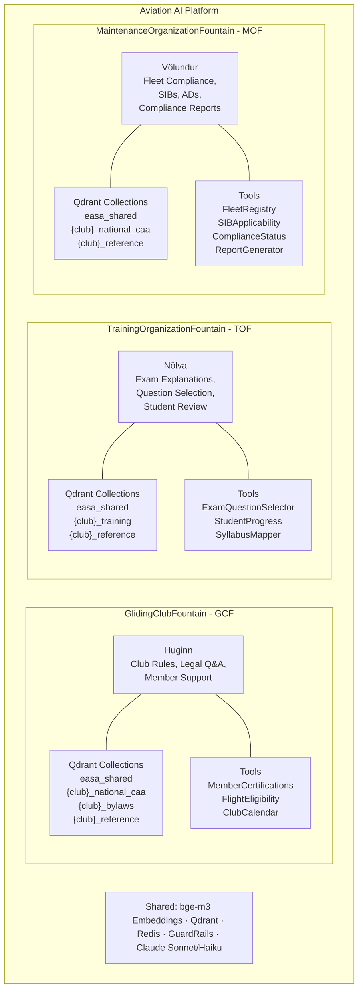
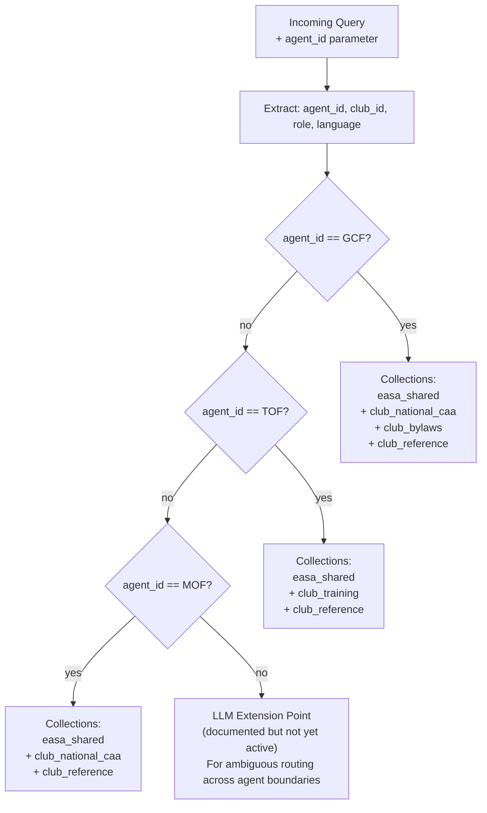
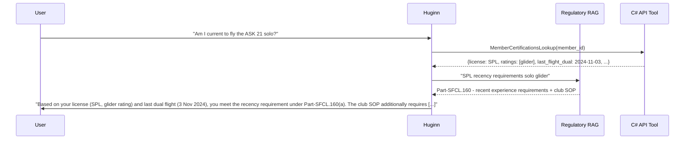

# The Three Agents

## Philosophy

The platform does not present a single general-purpose AI. It presents three agents, each with a distinct name, identity, scope, and set of tools. This is a deliberate design choice with practical consequences:

**Named agents set expectations.** A user asking Huginn about club bylaws and a user asking Völundur about SIB applicability are in fundamentally different epistemic contexts. The agent name signals the domain before the first token of response appears.

**Bounded scope enables honest refusal.** An agent with a clearly defined domain can say "this is outside my scope" without hedging. A general assistant cannot. In a regulated domain, the honest refusal is often more valuable than a plausible-sounding answer from outside the corpus.

**Norse mythology is intentional, not decorative.** Huginn (thought), Nölva (seeress lineage), Völundur (master craftsman). Each name carries semantic weight that matches the agent's function. When a developer reads the codebase, the names tell them which subsystem they are working in without needing to trace dependencies.

---

## Agent Overview



---

## QueryRouter

The QueryRouter is the entry point for all agent requests. It determines which agent handles the query and which Qdrant collections are searched.

### Current implementation: Rule-based routing



The agent_id is supplied by the frontend. Each UI surface hard-routes to its agent. A user accessing the compliance dashboard is talking to Völundur. A user opening the chat widget on the member portal is talking to Huginn. Ambiguous cross-agent routing is designed as an extension point but deliberately deferred: each agent's scope boundary must be well-validated before blurring them.

### LLM extension point

The architecture documents, but does not yet activate, an LLM-based routing layer for queries that arrive without a clear agent_id. When this is activated, the router will use a lightweight Haiku classification to determine agent assignment and log the routing decision for audit.

---

## Huginn - GlidingClubFountain (GCF)

**Named after:** Huginn (Old Norse: "thought"), one of Odin's two ravens. Huginn flies out into the world gathering information and returns to Odin with knowledge. An agent that gathers regulatory knowledge and returns answers to members.

### Purpose

The primary member-facing agent. Answers questions about club operations, rules, procedures, personal certification status, and regulatory obligations. Serves both members (casual Q&A) and management (governance, legal obligations, decision support).

Huginn maintains per-member memory across sessions (language preference, aircraft preference, and recurring topics) injected as context at session start. See [memory.md](memory.md) for the full memory design.

### Tools

| Tool | Source | Purpose |
|---|---|---|
| `MemberCertificationsLookup` | C# API | Current ratings, licenses, currency for the querying member (medical validity: future state - requires medical certificate reader AddOn) |
| `FlightEligibilityCheck` | C# API | Can this member fly type X today? What is missing? |
| `ClubCalendarQuery` | C# API | Upcoming events, scheduled maintenance windows, exam dates |
| `RegulatoryRAG` | Qdrant (hybrid) | EASA regs, national CAA, bylaws, reference material |

### System Prompt Philosophy

Huginn's system prompt establishes three things:

1. **Domain boundary**: Questions outside aviation club operations are declined politely. The agent does not drift into general legal advice, financial advice, or unrelated topics.
2. **Tier attribution**: Every cited piece of regulation must carry its tier badge (EASA binding / National binding / Reference). The model is instructed that omitting tier attribution is an error.
3. **Uncertainty handling**: The agent is explicitly instructed that "I don't know" is the correct answer when the corpus does not contain the information. It is never to construct a plausible-sounding answer from general knowledge.

### Response States

| State | Trigger | Behaviour |
|---|---|---|
| Grounded answer | Corpus contains relevant content | Answer with citations, tier badges, source language preserved |
| Partial answer | Corpus partially covers the question | Answer what is known, explicitly flag the gap |
| Scope refusal | Question outside aviation domain | "This is outside my scope. For [topic], please consult [resource]." |
| Honest unknown | Question in domain, corpus has no relevant content | "I don't have information about this in the current knowledge base." - dialogue flagged for review |
| Context-enriched | C# API tool call supplements RAG | Answer combines live member/fleet data with regulatory context |

### Scope Boundaries

**In scope:** EASA sailplane regulations, national CAA rules, club bylaws, operational procedures, member certification questions, club governance, airspace rules, weather minima for SPL/glider operations.

**Out of scope:** General aviation law beyond SPL/glider, financial/tax advice, medical certification assessment (agent can state requirements, not give medical opinions), questions about aircraft types not in the club fleet.

---

## Nölva - TrainingOrganizationFountain (TOF)

**Named after:** Derived from the same Proto-Germanic root as Völva (Old Norse: seeress, prophetess) - and deliberately echoes Tölva, the Icelandic word for computer (from tala, "number" + völva). Nölva is an AI teaching agent standing in the lineage of those who pass on knowledge.

### Purpose

Training and examination support. Nölva explains exam questions after submission (not before), selects questions intelligently based on student history, and maps answers back to the regulatory corpus. Where a student answered incorrectly, Nölva identifies the specific clause they misunderstood and retrieves the authoritative source.

Nölva maintains per-member memory across sessions (weak topic areas, exam history summary, and session summaries) injected as context at session start and complementing the structured scores in `StudentProgressQuery`. See [memory.md](memory.md) for the full memory design.

Nölva does not own exam question content. Questions are stored in MSSQL and served exclusively by the C# API. Nölva pulls questions via `ExamQuestionSelector`, it never creates, edits, or stores them.

### Tools

| Tool | Source | Purpose |
|---|---|---|
| `ExamQuestionSelector` | C# API (MSSQL) | Select questions by topic, difficulty, student history |
| `StudentProgressQuery` | C# API | Historical scores, weak topic areas, recent sessions |
| `SyllabusMapper` | Qdrant (`{club}_training`) | Map question to syllabus section |
| `RegulatoryExplanation` | Qdrant (hybrid) | Retrieve the regulatory basis for a correct answer |

### System Prompt Philosophy

Nölva's system prompt enforces two constraints not present in the other agents:

1. **No pre-exam answers**: Nölva will explain concepts and point to study material, but will not provide the answer to a question the student has not yet answered. The distinction is enforced via `exam_session_state` passed in the query context, a field set by the C# API based on the current session record in MSSQL. Nölva treats this as authoritative; it does not infer session state from the conversation history.
2. **Post-exam explanation depth**: After a question is answered, Nölva provides a full explanation with the authoritative source including the exact regulatory clause the question tests. Students learn from their errors with grounded citations, not paraphrased summaries.

### Intelligent Question Selection

Nölva does not select questions randomly. The `ExamQuestionSelector` tool uses:
- Student's historical weak topics (from `StudentProgressQuery`)
- Time since last question in each topic area
- Mandated minimum coverage from the syllabus

This produces adaptive exam sessions that focus remediation effort where it is needed.

### Scope Boundaries

**In scope:** SPL/glider exam preparation, training syllabus Q&A, post-exam explanations, study material retrieval, regulatory basis for exam topics.

**Out of scope:** Flight instruction (practical training), grade appeals, certification administration (agent explains requirements, the C# platform handles administrative actions).

---

## Völundur - MaintenanceOrganizationFountain (MOF)

**Named after:** Völundr (Old Norse), the master craftsman and smith, the most skilled artisan in Norse mythology. An agent that demands precision, tracks details, and ensures everything is in proper working order.

### Purpose

Fleet compliance intelligence. Völundur monitors Safety Information Bulletins and Airworthiness Directives, cross-references them against the club fleet using type certificate and serial number matching, determines applicability per aircraft, and generates compliance reports. This is the agent that keeps the fleet airworthy.

Völundur maintains per-member memory across sessions (aircraft interest and open compliance items being tracked ) injected as context at session start. See [memory.md](memory.md) for the full memory design.

### Tools

| Tool | Source | Purpose |
|---|---|---|
| `FleetRegistry` | C# API | All aircraft: registration, type_certificate, serial_number, year_of_manufacture |
| `SIBApplicabilityCheck` | C# API | Does this SIB apply to aircraft X? (TC + serial range matching against HITL-verified structured data in MSSQL) |
| `ComplianceStatusQuery` | C# API | Current open/acknowledged/actioned items per aircraft |
| `ComplianceReportGenerator` | C# API | Generate formal compliance report (all aircraft, all items, deadlines) |
| `SIBSemanticSearch` | Qdrant (MOF collections) | Full-text search over SIB content for questions about specific bulletins |

### Applicability Matching Logic

SIB applicability is determined by structured data extracted during ingestion (via the SIB dual pipeline, with HITL verification):

```
SIB applies to aircraft IF:
  type_certificate matches extracted TC range
  AND serial_number within stated range (if specified)
  AND (manufacturer + model used as fallback when TC not available)
```

When Völundur answers "does SIB 2024-17 apply to aircraft TF-SAC?", it is combining a structured database lookup with semantic RAG over the full SIB text. The structured data answers the binary applicability question, the RAG answers "what action is required and by when?"

### Compliance Report Contents

**Per-Aircraft View:**
- All applicable SIBs and ADs
- Status per item: Open / Acknowledged / Actioned / N/A
- Deadline flagging: overdue (red), due within 30 days (amber), compliant (green)

**Fleet Summary:**
- Total open items across fleet
- Overdue items (critical, requires immediate attention)
- New bulletins since last report
- Compliance score per aircraft

**Regulatory Change Log:**
- New bulletins detected in last ingestion cycle
- Documents updated (checksum-triggered re-ingestion)

### System Prompt Philosophy

Völundur's system prompt is the most constrained of the three:

1. **No speculative applicability**: If applicability cannot be determined from structured data (TC match + serial range), Völundur says so and recommends manual review. It does not infer applicability from partial matches.
2. **Mandatory tier attribution**: All compliance guidance attributes to EASA (binding) vs national authority (binding) vs BGA/reference (informational). A recommended action from BGA is not an airworthiness directive.
3. **Deadline precision**: When a compliance deadline is known, it is stated precisely. When it is unknown or the SIB says "as soon as practicable", Völundur quotes the source text verbatim rather than inferring a date.

### Scope Boundaries

**In scope:** SIB/AD compliance monitoring, fleet airworthiness status, applicability reasoning, formal compliance report generation, questions about specific bulletins and their requirements.

**Out of scope:** Maintenance instructions (Völundur tells you what needs doing and by when; the AMM tells you how), airworthiness certificate administration, modifications and STCs beyond what the indexed documents cover.

---

## Context-Aware Responses - C# API as a Live Tool

All three agents can call the C# API as a tool alongside RAG. This is what makes responses context-aware rather than generic:



The agent does not answer from general knowledge about what SPL recency requirements are. It retrieves the specific member's current certification state from the C# API, then retrieves the applicable regulation from Qdrant, and synthesises an answer grounded in both. This is the hybrid retrieval pattern: structured data (C# API) + unstructured knowledge (Qdrant RAG).

---

## The "I Don't Know" Principle

All three agents are explicitly instructed that honest uncertainty is a correct and valuable response. The instruction is not "say you don't know when you're not sure". It is "the corpus is your only source of truth; if the answer is not there, it does not exist for you."

When an agent returns an honest-unknown response:

1. The response is clearly styled in the UI (visually distinct from grounded answers)
2. The dialogue is automatically flagged to `dialogue_flags` in MSSQL
3. Flagged dialogues appear in the Admin Panel review queue
4. A human reviewer classifies the flag: out-of-scope question, missing document, or ingestion gap
5. If a document is missing, it is added to the source manifest and ingested
6. The next time the question is asked, the agent has the answer

This is the feedback loop that makes the knowledge base self-improving over time. "I don't know" is not a failure, it is a signal.
