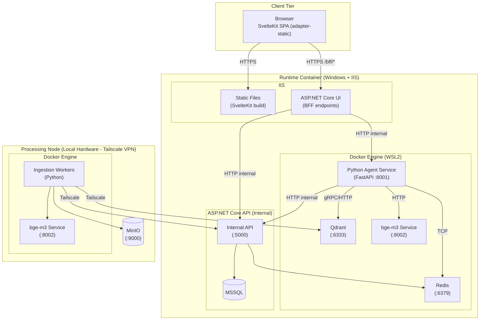
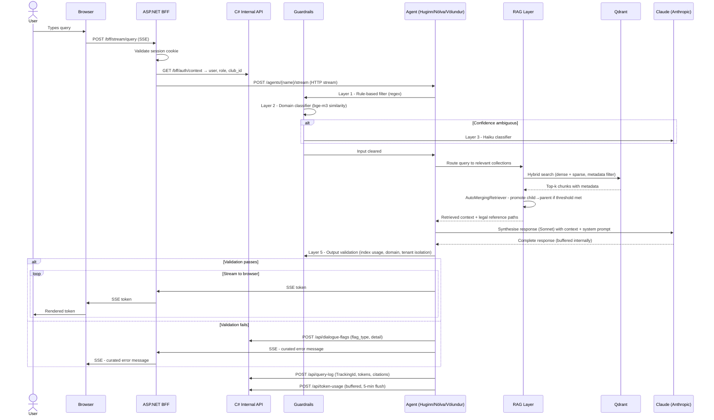
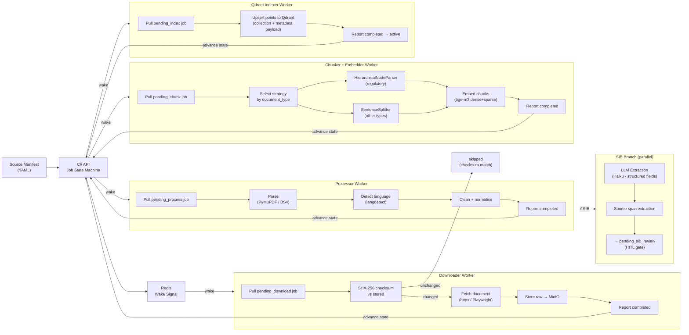
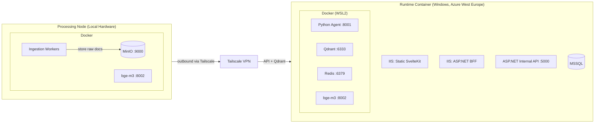

# System Architecture

## Overview

The platform follows a **three-tier layered architecture** with a hard split between the runtime node (Windows container + IIS) and the processing node (local hardware via Tailscale). The C# platform handles auth, session management, BFF proxying, job orchestration, and structured data. The Python layer handles all AI operations: embedding, retrieval, agent reasoning, and guardrails.

Note: Port numbers shown are development defaults. Production port configuration is defined separately in `docker-compose.prod.yml`.

---

## Component Responsibilities

### Browser / SvelteKit Frontend

Built with SvelteKit using `adapter-static`. The output is a static file bundle (HTML, JS, CSS) served directly from IIS. There is no SSR; all dynamic content is fetched from BFF endpoints. This means IIS has zero Python or Node.js dependency at runtime.

Key surfaces:
- **Chat widget / full-page chat**  Huginn interface with SSE streaming
- **Compliance Dashboard** Völundur fleet status + embedded chat
- **SIB HITL Review** Source-side document viewer + extracted fields editor
- **Admin Panel** Pipeline monitor, cost analytics, AI inspection history

### ASP.NET Core UI (BFF Layer)

Sits in IIS as a reverse proxy and Backend-for-Frontend. Owns session auth. The browser authenticates once via the existing C# platform auth flow. All subsequent requests carry the session cookie.

BFF (Backend For Frontend) endpoints:

| Endpoint | Purpose |
|---|---|
| `GET /bff/auth/context` | Returns current user: role, club_id, display name |
| `POST /bff/stream/query` | SSE proxy: browser → BFF → Python agent |
| `GET /bff/members/search` | Member lookup with certification data |
| `GET /bff/fleet` | Fleet data for compliance dashboard |

The SSE proxy is the critical path for streaming: the browser opens an EventSource to `/bff/stream/query`, the BFF opens an HTTP stream to the Python agent, and tokens are forwarded as they arrive. The browser never communicates with Python directly.

### ASP.NET Core API (Internal)

The central coordination service. Not exposed to the browser. Owns:
- **Job state machine** All ingestion job state in MSSQL
- **Pull orchestration** Workers claim jobs via this API
- **Cost tracking** Token usage log, model pricing table, cost period summaries
- **Query log** Every agent query recorded with TrackingId
- **SIB verification** Approve/reject/edit extracted SIB data
- **AI inspection logging** Test pipeline results, pass rate history
- **Tenant management** Club provisioning, collection registration

### Python Agent Service (FastAPI)

The AI execution layer. Stateless by design. All persistent state lives in MSSQL, Qdrant, or Redis. Runs in Docker.

Responsibilities:
- Receive query requests from BFF (via ASP.NET UI)
- Execute five-layer guardrail pipeline on input
- Route to appropriate agent (Huginn / Nölva / Völundur)
- Execute RAG retrieval (hybrid bge-m3 via Qdrant)
- Stream response tokens via SSE
- Log query + token usage back to C# API
- Execute guardrail output validation

### Ingestion Workers (Python Processing Node)

Stateless worker processes running on local hardware (or any node). They connect to the C# API via Tailscale and pull jobs. No persistent state: job state lives in MSSQL, raw documents in MinIO, vectors in Qdrant.

Worker types: Downloader, Processor, Chunker+Embedder, Qdrant Indexer, SIB Extractor.

### Qdrant

Vector database. Multi-tenant via named collections. Stores both dense vectors (bge-m3) and sparse vectors (bge-m3 SPLADE output) per point, enabling native hybrid search. All metadata filtering happens in Qdrant, no post-retrieval filtering in Python.

### Redis

Two roles:
1. **Worker wake-up stream** C# API publishes a lightweight signal when new jobs are created; workers wake immediately rather than polling on a timer.
2. **Session chat store** `SimpleChatStore` for conversation context per session, keyed by session_id.

### MinIO

S3-compatible object storage for raw downloaded documents. Workers store raw files here after download. The Processor worker reads from MinIO. This decouples download from processing, a re-process can run against the stored raw file without re-downloading.

### MSSQL

All structured data: job state, ingestion tracking, query logs, token usage, model pricing, SIB extraction records, compliance status, dialogue flags, AI inspection run results, conversation sessions. The single source of truth for operational state.

---

## Request Flow - User Query

---

## Data Flow - Ingestion Pipeline

---

## Split Deployment Topology

The split works because of the pull-based architecture. Workers on the processing node make outbound HTTPS calls to the C# API via Tailscale and no inbound ports needed on the processing node. When the VM eventually handles ingestion load, the workers simply move to a Docker container on the VM with zero architecture change.

---

## Multi-Tenant Isolation

Every query and every stored vector is tenant-scoped. Isolation is enforced at two independent layers:

**Collection-level isolation (Qdrant):**

| Collection | Scope | Tenant access |
|---|---|---|
| `easa_shared` | Shared - all clubs | Always included |
| `{club_id}_national_caa` | Per-club national regulations | Own club only |
| `{club_id}_reference` | Per-club reference material | Own club only |
| `{club_id}_bylaws` | Per-club bylaws | Own club only |
| `{club_id}_training` | Per-club training material | Own club only |

**Metadata filter isolation (within collections):**

Every Qdrant point carries `club_id` in its payload. All queries include a mandatory `club_id` filter alongside the vector similarity search. A query for club A cannot retrieve vectors tagged with club B even if they share a collection.

The C# API resolves `club_id` from the authenticated session before forwarding to Python. The Python agent receives `club_id` as a parameter since it does not trust client-supplied values.

---

## Service Communication

| From | To | Protocol | Auth |
|---|---|---|---|
| Browser | IIS (static) | HTTPS | Session cookie |
| Browser | ASP.NET BFF | HTTPS | Session cookie |
| ASP.NET BFF | Python Agent | HTTP (internal Docker network) | API key (internal) |
| ASP.NET BFF | C# Internal API | HTTP (internal) | Service token |
| Python Agent | C# Internal API | HTTP | Service token |
| Python Agent | Qdrant | HTTP REST or gRPC (internal) | None (internal network) |
| Python Agent | Redis | TCP | None (internal network) |
| Python Agent | bge-m3 | HTTP | None (internal network) |
| Ingestion Workers | C# Internal API | HTTPS via Tailscale | Service token |
| Ingestion Workers | Qdrant | HTTPS via Tailscale | None |
| Ingestion Workers | MinIO | HTTP | MinIO access key |
| Ingestion Workers | Anthropic API | HTTPS | API key |
| ASP.NET BFF (SIB review) | MinIO (processing node) | HTTPS via Tailscale | MinIO access key |

---

## Agent Security

**The client sends a query string and a JWT. Nothing else is trusted.**

All context required to process an agent request (`member_id`, `club_id`), role, and permitted agent scope that is resolved by the C# BFF from the validated JWT claims. These values are never accepted from the request body. The Python agent receives server-resolved context only.

Role-based access control is enforced by the existing ASP.NET auth layer before any request reaches the agent. A user's role determines which agents they may address for example: a regular member cannot reach Völundur (MOF) regardless of what they send. If the role check fails, the request is rejected at the BFF before it is forwarded to Python.

The Python agent therefore operates in a pre-validated context: by the time a query arrives, the caller's identity, club, and permitted scope have already been established and cannot be influenced by client-supplied data.

**Tool call results are internal.** When an agent calls a C# API tool (`MemberCertificationsLookup`, `FleetRegistry`, etc.), the raw structured response stays within the Python agent. The BFF forwards only the synthesised agent response to the client, never the underlying data payloads.

**No external content is rendered.** All regulatory documents are self-hosted. Agent responses contain citations that link to source documents within the platform. No content from external URLs is rendered in the client. This eliminates the XSS attack surface from citation rendering.

**Prompt injection defence is layered.** GuardRails Layer 1 filters known injection patterns on input. The second line of defence is architectural: each agent is strictly corpus-grounded and a query attempting to extract out-of-scope data will find nothing in the collections to ground an answer with. An agent that cannot retrieve does not fabricate.
