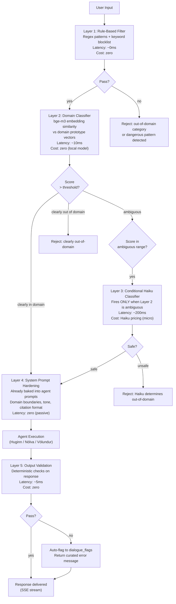
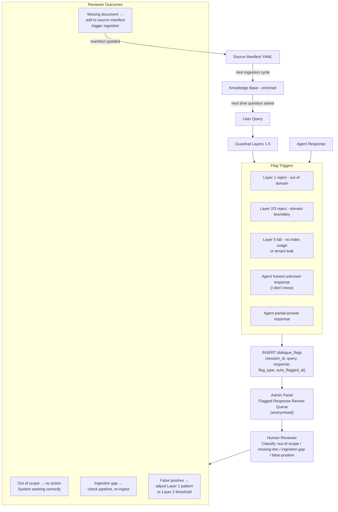

# Guardrail System

## Threat Surface

In a regulated-domain AI platform, the threats are not primarily adversarial injection attacks. They are subtler and more consequential:

| Threat | Example | Consequence |
|---|---|---|
| Out-of-domain confident answering | "What are the tax implications of club membership?" answered from general knowledge | User acts on legally incorrect information presented as authoritative |
| Regulatory tier confusion | BGA guidance cited as EASA binding regulation | Compliance decision made on non-binding reference |
| Cross-tenant data leakage | Club A query returns Club B's private bylaws | Privacy breach, loss of tenant isolation |
| Hallucinated citation | Agent fabricates a regulation article number | User cannot verify; dangerous in a compliance context |
| Prompt injection via document content | Malicious text in an uploaded document attempts to override system prompt | Agent behaviour hijacked |
| Index misuse | Agent answers from general knowledge when index returns no results | Bypasses the whole RAG system |

The guardrail stack addresses these threats through independent layers. No single layer is relied upon alone.

---

## Five Layers - Fast to Slow



---

## Layer 1 - Rule-Based Filter

The fastest layer. Runs before any model call. Zero latency, zero cost.

**Regex patterns** catch structurally identifiable out-of-scope inputs:
- Requests for financial/investment/tax advice
- Medical diagnosis requests (the agent can state medical certificate requirements, not diagnose)
- Legal advice about matters unrelated to aviation regulations
- Explicit prompt injection patterns ("ignore your previous instructions", "you are now DAN")
- PII patterns (credit card numbers, national ID formats, these should never reach the model)

**Keyword blocklist** catches domain-level off-topic signals. Aviation is a narrow domain; an extensive blocklist is practical.

This layer is intentionally not ML-based. If it falsely rejects a legitimate query, the pattern is wrong and must be fixed. The rule-based nature makes it debuggable and auditable, every rejection has an explicit cause.

---

## Layer 2 - Domain Classifier

bge-m3 is already running for query embedding. The same model classifies the query's domain by computing cosine similarity against a set of prototype vectors representing the platform's domain:

```python
DOMAIN_PROTOTYPES = {
    "aviation_regulations": embed("EASA sailplane regulation flight operations"),
    "club_operations": embed("glider club member operations procedures"),
    "fleet_maintenance": embed("aircraft airworthiness SIB maintenance compliance"),
    "training_examination": embed("pilot licence exam training syllabus"),
    "airspace_weather": embed("airspace rules weather minima VFR"),
}

OUT_OF_DOMAIN_PROTOTYPES = {
    "financial": embed("tax investment accounting financial advice"),
    "medical_diagnosis": embed("medical diagnosis treatment health condition"),
    "legal_general": embed("legal advice contract law lawsuit"),
    "unrelated": embed("cooking recipe sports entertainment politics"),
}

def classify_domain(query_embedding: np.ndarray) -> DomainClassification:
    in_domain_max = max(
        cosine_similarity(query_embedding, proto)
        for proto in DOMAIN_PROTOTYPES.values()
    )
    out_domain_max = max(
        cosine_similarity(query_embedding, proto)
        for proto in OUT_OF_DOMAIN_PROTOTYPES.values()
    )

    if in_domain_max > CLEAR_THRESHOLD:     # e.g. 0.75
        return DomainClassification.IN_DOMAIN
    if out_domain_max > CLEAR_THRESHOLD:
        return DomainClassification.OUT_OF_DOMAIN
    return DomainClassification.AMBIGUOUS   # triggers Layer 3
```

The thresholds are calibrated against a labelled dataset. The `AMBIGUOUS` range is deliberately narrow because the goal is to send as few queries as possible to Layer 3 while catching all genuinely ambiguous cases.

---

## Layer 3 - Conditional Claude Haiku Classifier

This layer exists because the domain boundary is not always clear. "What are the weather conditions under which I can fly?" is aviation. "What is the weather like today?" is not. At certain confidence levels, the embedding similarity cannot distinguish them reliably.

**Critical design decision: this layer only fires when Layer 2 returns AMBIGUOUS.**

A clear in-domain query (regulations question, compliance question) never touches Haiku. This keeps the common-case latency path at ~10ms and the cost effectively zero for the vast majority of queries.

```python
async def layer3_haiku_classify(query: str, context: QueryContext) -> SafetyDecision:
    """
    Only called when Layer 2 confidence is ambiguous.
    Uses Haiku - not Sonnet - because this is classification, not reasoning.
    """
    response = await haiku_client.messages.create(
        model="claude-haiku-4-5-20251001",
        max_tokens=20,
        system=GUARDRAIL_SYSTEM_PROMPT,
        messages=[{
            "role": "user",
            "content": f"""Is this query within scope for an aviation club AI assistant?

Query: {query}
Agent: {context.agent_id}
User role: {context.role}

Respond with exactly one word: SAFE or UNSAFE"""
        }]
    )

    decision = response.content[0].text.strip().upper()
    log_guardrail_decision(layer=3, query=query, decision=decision, tokens=response.usage)
    return SafetyDecision.SAFE if decision == "SAFE" else SafetyDecision.UNSAFE
```

Token usage from Layer 3 calls is logged at TrackingId level, the same cost tracking infrastructure as all other model calls.

---

## Layer 4 - System Prompt Hardening

Layer 4 is passive: It is not a runtime check but a design constraint baked into all three agent system prompts. It is listed as a layer because it is an independent line of defence that would catch certain threats even if Layers 1-3 failed.

**Domain scope instruction:** Each agent system prompt explicitly states its domain boundary and instructs the model to decline questions outside it.

**Citation format instruction:** The model is instructed that all answers drawing from the regulatory corpus must include citations in the specified format, with tier attribution. An answer without a citation is not a valid grounded answer.

**Uncertainty instruction:** The model is instructed that "I don't know" is the correct response when the corpus does not cover the question. It is explicitly told not to draw on general knowledge to fill gaps.

**Tenant isolation instruction:** The model is told that it is operating for a specific club (identified by club_id in the system prompt context block) and must not reference information from other organisations.

---

## Layer 5 - Deterministic Output Validation

After the agent produces a response, a deterministic validation step runs before anything is sent over the wire. The agent buffers the complete response internally; Layer 5 validates it in full. Only then does the first token stream to the BFF and on to the browser. If validation fails, the original response is discarded and a curated error message is sent instead,  deliberately vague to the user ("a quality check detected an issue with this response"), with full detail written to `dialogue_flags` for admin review.

This is not a UX regression. Responses in this domain are short and citation-anchored by design (200-400 tokens at most). The buffering delay is indistinguishable from normal generation latency. The benefit is clean semantics: what the user sees is always a validated response, with no mid-stream cutoffs or partial failure states to handle.

### The Three Checks

**Check 1: Index Usage Verification**

Did the agent actually use the retrieved context, or did it answer from general knowledge?

```python
def validate_index_usage(response: AgentResponse) -> ValidationResult:
    """
    Verify that source_nodes were actually used in synthesis.
    An agent response with zero citations on a factual question is suspicious.
    """
    if response.response_type == ResponseType.FACTUAL:
        if not response.source_nodes or len(response.source_nodes) == 0:
            return ValidationResult.FAIL_NO_INDEX_USAGE
    return ValidationResult.PASS
```

**Check 2: Domain Boundary Check**

Scan the response for signals that the model answered outside its domain. A set of patterns that would only appear in out-of-domain responses (financial figures, medical diagnoses, general news) triggers a flag.

**Check 3: Tenant Isolation Leak Check**

Verify that no chunk in `source_nodes` carries a `club_id` that does not match the requesting club's `club_id`. This is the final defence against cross-tenant data leakage. A check that runs even if the Qdrant metadata filter somehow failed.

```python
def validate_tenant_isolation(
    response: AgentResponse,
    requesting_club_id: str
) -> ValidationResult:
    for node in response.source_nodes:
        node_club_id = node.metadata.get("club_id")
        if node_club_id and node_club_id != requesting_club_id:
            log_tenant_leak_attempt(
                requesting_club=requesting_club_id,
                leaked_club=node_club_id,
                node_id=node.node_id,
            )
            return ValidationResult.FAIL_TENANT_LEAK
    return ValidationResult.PASS
```

---

## Why NeMo Guardrails Was Rejected

NeMo Guardrails (NVIDIA) was evaluated as a candidate for this guardrail stack. The evaluation result is documented explicitly because the decision to not adopt a well-known tool deserves a rationale.

**Evaluation findings:**

| Criterion | NeMo Guardrails | Decision |
|---|---|---|
| Latency overhead | ~150-400ms on every query (Colang DSL parsing + LLM guard calls) | Unacceptable - adds to every query regardless of domain clarity |
| Dependency weight | CUDA dependency chain, NVIDIA-specific libraries | Incompatible with self-hosted, hardware-agnostic deployment |
| Deterministic coverage | Colang rules cover some cases; probabilistic LLM guard covers others - mixed reliability | Our deterministic Layer 1 + Layer 5 cover the same ground with zero ambiguity |
| Tenant isolation checking | Not natively supported | Must be custom; same effort as native implementation |
| Conditional execution | All guards run on every query | Layer 3 (the expensive call) only fires when needed |
| Auditability | Guard decisions are partially opaque (LLM-generated) | Every decision in our stack has an explicit, loggable cause |
| Operational complexity | Separate service with its own deployment lifecycle | No separate service needed |

**Conclusion:** NeMo Guardrails solves a different problem - general-purpose LLM safety for unknown threat surfaces. This platform has a known, narrow domain. The deterministic layers (1 and 5) cover the structural threats reliably. The embedding classifier (Layer 2) covers the domain boundary efficiently. The conditional Haiku (Layer 3) handles genuine ambiguity at minimal cost. The combination is faster, cheaper, more auditable, and more precisely targeted than NeMo would be.

---

## Dialogue Flagging - The Full Loop



This feedback loop is the mechanism by which the platform improves over time without retraining. Every honest-unknown response is an implicit gap report. The loop closes when the gap is filled and the next identical question gets a grounded answer.

---

## Parallel to Other Regulated Industries

The five-layer pattern is not unique to aviation compliance. The same architecture applies wherever:
- The domain is bounded and verifiable
- Hallucinated answers have real-world consequences
- Citations to authoritative sources are required (not just helpful)
- Tenant data isolation is a compliance requirement

The same pattern would apply to pharmaceutical compliance AI (regulatory submissions), financial services (regulatory reporting), medical device documentation, or legal practice management. The domain changes; the architecture does not.
