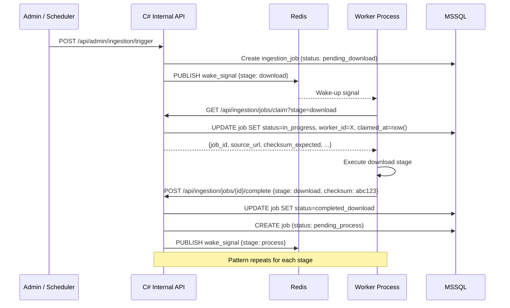
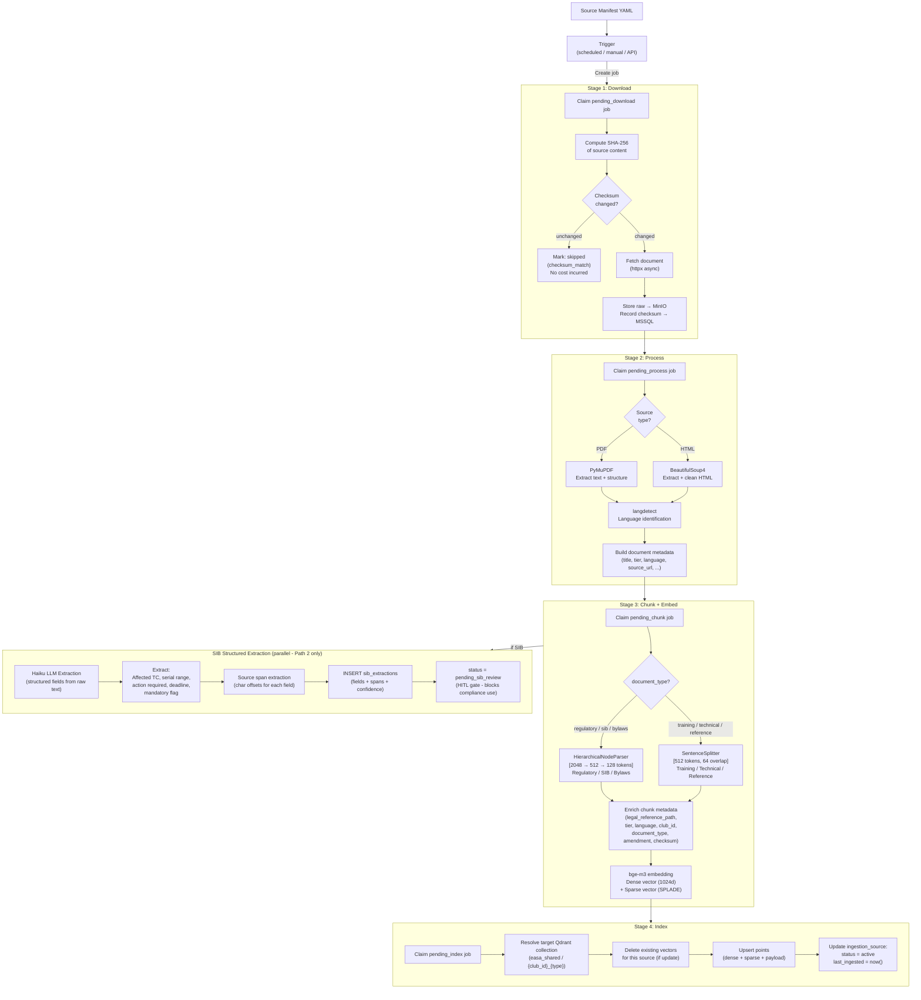
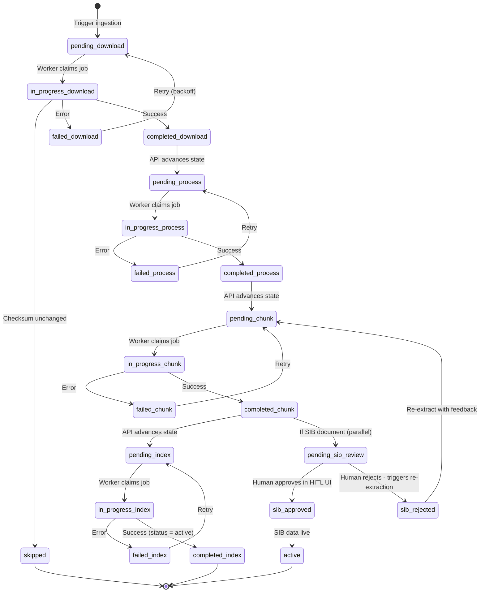
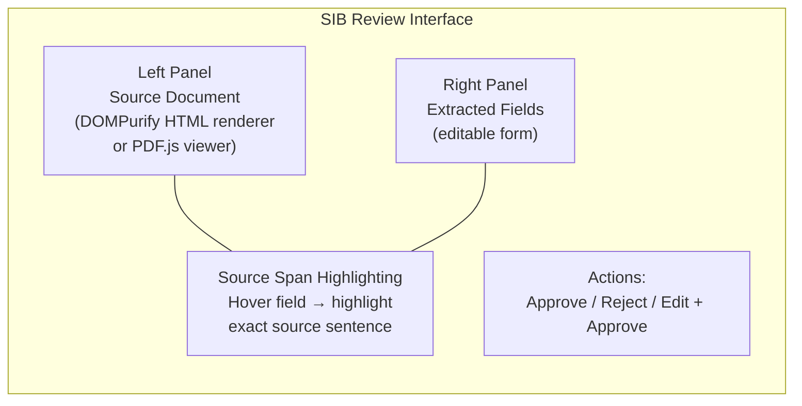
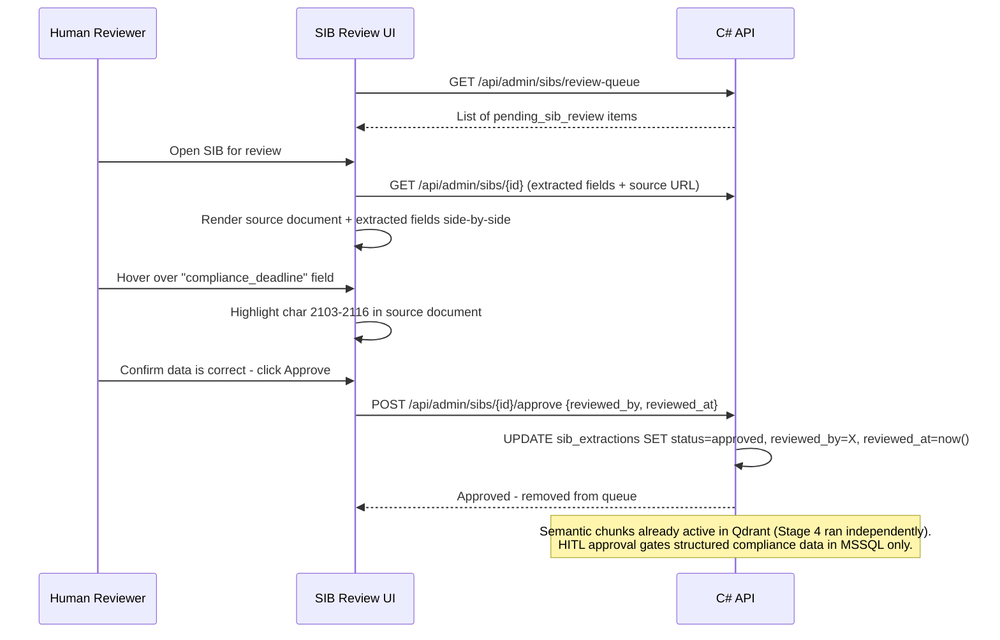

# Ingestion Pipeline

## Overview

The ingestion pipeline transforms raw regulatory documents. PDFs from EASA, HTML pages from national CAAs, competition rules from FAI and puts it into semantically indexed, metadata-rich vector representations stored in Qdrant. It is designed around three principles: cost control (never re-embed an unchanged document), auditability (every stage tracked in MSSQL), and flexibility (the processing node can run anywhere with a Tailscale connection).

---

## Source Manifest

All ingestion is driven by a YAML manifest. Adding a new document source means adding a manifest entry. No code changes required.

```yaml
sources:
  # Tier 1 - EASA Shared (club_id: null means shared across all tenants)
  - id: easa_easy_access_sailplane
    title: "EASA Easy Access Rules for Sailplanes (Part-SFCL, Part-NCO)"
    url: "https://www.easa.europa.eu/en/downloads/94424/en"
    type: pdf
    tier: 1
    language: en
    document_type: regulatory
    club_id: null
    schedule: weekly

  - id: easa_cs22_amendment2
    title: "CS-22 Amendment 2 - Sailplane Airworthiness Standards"
    url: "https://www.easa.europa.eu/en/downloads/..."
    type: pdf
    tier: 1
    language: en
    document_type: regulatory
    club_id: null
    schedule: weekly

  - id: easa_sibs_sailplane
    title: "EASA Safety Information Bulletins - Sailplane Category"
    url: "https://ad.easa.europa.eu/search/sailplane"
    type: sib_index            # triggers SIB crawl + filter + dual pipeline
    tier: 1
    language: en
    document_type: sib
    club_id: null
    schedule: daily
    filters:
      categories:
        - "Sailplanes & Powered Sailplanes"
        - "Touring Motor Gliders"
        - "Equipment & Avionics"
        - "General Aviation - Airspace & Procedures"
        - "General Aviation - Weather"

  # Tier 2 - National CAA (per club)
  - id: iceavia_sfcl_is
    title: "Samgöngustofa - Flugþjálfun og leyfi"
    url: "https://www.samgongustofa.is/flug/flugmenn/..."
    type: html
    tier: 2
    language: is
    document_type: regulatory
    club_id: "${CLUB_ID_ICELAND_EXAMPLE}"
    schedule: weekly

  # Tier 3 - Reference material (per club)
  - id: bga_gliding_syllabus
    title: "BGA Gliding Syllabus"
    url: "https://www.gliding.co.uk/..."
    type: pdf
    tier: 3
    language: en
    document_type: training_syllabus
    club_id: "${CLUB_ID_ICELAND_EXAMPLE}"
    schedule: monthly

  - id: fai_sc3_sporting_code
    title: "FAI Sporting Code Section 3 - Gliding"
    url: "https://www.fai.org/..."
    type: pdf
    tier: 3
    language: en
    document_type: regulatory
    club_id: null               # available to all clubs as reference
    schedule: monthly
```

The `schedule` field controls when the re-ingestion check runs. The `document_type` field drives which chunking strategy is applied. `club_id: null` marks shared documents available to all tenants.

### `sib_index` Source Type

Sources with `type: sib_index` require a crawl step before download. Rather than fetching a single URL, the downloader fetches the EASA SIB search index page, filters results by the configured categories, and queues individual SIB PDFs as separate download jobs - one job per SIB. Each SIB then proceeds through the standard pipeline independently. This is the only source type that generates multiple child jobs from a single manifest entry.

---

## Pull-Based Orchestration

### Why Not Celery / Airflow / Prefect

Airflow, Prefect, Temporal, and Dagster are the standard orchestration choices for data pipelines. They were evaluated and rejected for this project. The decision is documented explicitly:

| Concern | Orchestration tool | This architecture |
|---|---|---|
| Job state ownership | Tool-internal (hard to query, extend) | MSSQL - queryable, tenant-aware, already audited |
| Audit trail | Plugin or separate logging | Native - every stage in the same database as everything else |
| Multi-tenancy | Custom implementation required | Already modelled in job schema |
| Extra services | Airflow needs scheduler + webserver + metadata DB | None - C# API already runs |
| Split deployment | Requires network access to orchestrator | Workers only need outbound HTTPS to C# API |
| Retry / re-run | Depends on tool's UI | Any stage reset to pending via admin panel or API |

The custom approach is more work upfront. It is less work over the life of the system.

### Flow



Workers are stateless. They have no knowledge of job history, only the current job they have claimed. Scale any stage independently by running more worker processes of that type.

### Stale Claim Detection

A worker that crashes mid-job would leave the job permanently `in_progress` without a heartbeat mechanism. Workers send a heartbeat (`POST /api/ingestion/jobs/{id}/heartbeat`) every 30 seconds while processing. The C# API runs a background check: any job in `in_progress` with no heartbeat for longer than `WORKER_CLAIM_TIMEOUT_S` (default 300s) is automatically reset to its `pending_*` state and re-queued. This ensures a crashed worker never silently blocks the pipeline.

---

## Pipeline Stages



---

## Job State Machine



Any stage can be manually reset to its `pending_*` state from the Admin Panel. This enables targeted re-runs without triggering the full pipeline - useful when a chunking strategy is updated and specific documents need re-indexing.

---

## Checksum Strategy

Every download computes a SHA-256 hash of the raw content before storing to MinIO. This hash is compared against the `last_checksum` field in `ingestion_sources`.

**On match:** The job is marked `skipped (checksum_match)`. No processing, no chunking, no embedding, no API cost. The `last_checked` timestamp is updated.

**On mismatch:** Full pipeline runs. The old Qdrant vectors for this source are deleted before new ones are indexed. The `superseded_by` chain in `ingestion_sources` is updated. Enabling queries like "what was the active version of Part-SFCL.160 on 2023-06-01?"

This is the primary cost control mechanism. EASA regulations do not change daily. The weekly schedule check incurs only the HTTP HEAD request cost for unchanged documents.

---

## SIB Dual Pipeline

Safety Information Bulletins require two parallel processing paths because they serve two distinct purposes: semantic Q&A (via RAG) and structured compliance checking (via applicability matching).

### Path 1: Semantic Chunking (standard pipeline - no HITL gate)

SIBs go through Stages 1-4 like any regulatory document. Semantic chunks land in Qdrant and are immediately active. This enables Huginn and Völundur to answer questions like "what does SIB 2024-17 say about the inspection interval?" from day one. No review required, because the chunks are verbatim source text, not LLM-generated.

### Path 2: Structured LLM Extraction (HITL gated)

A separate worker runs Claude Haiku against the raw SIB text to extract structured fields. This path is gated by HITL because the extracted values (type certificates, serial ranges, compliance deadlines, mandatory flags) drive Völundur's compliance matching. An extraction error here could cause an SIB to be incorrectly applied or missed entirely. The structured data does not become active until a human reviewer approves it.

A separate worker runs Claude Haiku against the raw SIB text to extract structured fields:

```json
{
  "sib_number": "2024-17",
  "title": "Airspeed Indicator Calibration - DG-808 Series",
  "affected_type_certificates": ["EASA.A.605"],
  "affected_serial_ranges": [
    {"from": "8-001", "to": "8-247"},
    {"from": "8-500", "to": null}
  ],
  "action_required": "Inspect and re-calibrate airspeed indicator per Manufacturer Service Bulletin SB-808-47",
  "compliance_deadline": "2025-03-31",
  "mandatory": true,
  "confidence": 0.94,
  "source_spans": {
    "affected_type_certificates": {"start": 847, "end": 862},
    "compliance_deadline": {"start": 2103, "end": 2116},
    "action_required": {"start": 1456, "end": 1612}
  }
}
```

The `source_spans` field stores character offsets for every extracted value. These offsets power the HITL review UI's source span highlighting.

---

## HITL SIB Verification

No SIB extraction becomes operationally active until a human reviewer approves it. This is not optional. It is the state machine. The `pending_sib_review` state is a mandatory gate.

### Review UI



### Review Flow



On **Reject**, the reviewer provides rejection notes. The pipeline resets to `pending_chunk` and the re-extraction runs with the rejection notes as additional context for the Haiku extraction prompt.

On **Edit + Approve**, the reviewer corrects individual fields. The corrected values supersede the LLM extraction; the original extraction is retained for audit.

---

## Ingestion Tracking

### MSSQL Schema

```sql
-- Document source registry
ingestion_sources (
  id                UNIQUEIDENTIFIER PRIMARY KEY,
  club_id           UNIQUEIDENTIFIER NULL,          -- NULL = shared (EASA)
  source_url        NVARCHAR(2048),
  document_title    NVARCHAR(512),
  tier              TINYINT,                        -- 1, 2, 3
  language          NVARCHAR(10),                   -- en, is, no
  document_type     NVARCHAR(50),
  version           NVARCHAR(100),                  -- amendment / version if applicable
  last_checksum     NVARCHAR(64),                   -- SHA-256
  last_ingested     DATETIME2,
  last_checked      DATETIME2,
  ingested_by       NVARCHAR(255),                  -- "scheduler" / "admin:{userid}"
  trigger_type      NVARCHAR(50),                   -- manual / scheduled / api
  status            NVARCHAR(50),                   -- current / superseded / failed
  superseded_by     UNIQUEIDENTIFIER NULL,          -- FK for version chain
  qdrant_index_id   NVARCHAR(255)
)

-- Per-stage job tracking
ingestion_jobs (
  id                    UNIQUEIDENTIFIER PRIMARY KEY,
  ingestion_source_id   UNIQUEIDENTIFIER,
  triggered_at          DATETIME2,
  triggered_by          NVARCHAR(255),
  trigger_type          NVARCHAR(50),
  stage                 NVARCHAR(50),               -- download / process / chunk / index
  status                NVARCHAR(50),               -- pending / in_progress / completed / failed / skipped
  worker_id             NVARCHAR(255),
  claimed_at            DATETIME2,
  completed_at          DATETIME2,
  skipped_reason        NVARCHAR(255),              -- e.g. "checksum_match"
  error_message         NVARCHAR(MAX),
  duration_ms           INT
)
```

### API Endpoints

```
POST /api/admin/ingestion/trigger           Trigger ingestion for one source or all
GET  /api/admin/ingestion/jobs              List all jobs (filterable by stage, status, club)
GET  /api/admin/ingestion/jobs/{id}         Specific job detail
GET  /api/admin/ingestion/jobs/{id}/stages  Per-stage breakdown for a job
GET  /api/admin/ingestion/sources           All tracked document sources
GET  /api/admin/ingestion/sources/{id}/history  Full version history of a document

# Pull orchestration (workers only - internal service token)
GET  /api/ingestion/jobs/claim?stage={stage}&worker_id={id}
POST /api/ingestion/jobs/{id}/complete
POST /api/ingestion/jobs/{id}/fail
POST /api/ingestion/jobs/{id}/heartbeat
```

---

## Document Source Catalogue

### Tier 1 - EASA (Shared - all tenants)

| Document | Language | Format | Schedule |
|---|---|---|---|
| EASA Easy Access Rules - Sailplanes (Part-SFCL, Part-NCO) | English | PDF | Weekly |
| EASA Easy Access Rules - SERA (Standardised European Rules of the Air) | English | PDF | Weekly |
| EASA Easy Access Rules - Continuing Airworthiness | English | PDF | Weekly |
| EASA Easy Access Rules - DTO (Declared Training Organisations) | English | PDF | Weekly |
| EUR-Lex 2018/1976 - EU Regulation on sailplanes | English | HTML | Weekly |
| CS-22 Amendment 1 - Sailplane Airworthiness Standards | English | PDF | Monthly |
| CS-22 Amendment 2 - Sailplane Airworthiness Standards | English | PDF | Monthly |
| EASA SIBs - Sailplanes & Powered Sailplanes | English | PDF (crawled) | Daily |
| EASA SIBs - Touring Motor Gliders | English | PDF (crawled) | Daily |
| EASA SIBs - Equipment & Avionics | English | PDF (crawled) | Daily |
| EASA SIBs - GA Airspace & Procedures | English | PDF (crawled) | Daily |
| EASA SIBs - GA Weather | English | PDF (crawled) | Daily |

### Tier 2 - National CAA (per club)

| Document | Language | Format | Club |
|---|---|---|---|
| Samgöngustofa - Flight training and licensing | Icelandic | HTML | Icelandic clubs |
| NLF - Seilfly og motorsveveflyging | Norwegian | HTML/PDF | Norwegian clubs |

### Tier 3 - Reference Material (per club or shared)

| Document | Language | Format | Scope |
|---|---|---|---|
| BGA Gliding Syllabus | English | PDF | Per club |
| BGA LAWR (Laws and Rules) | English | PDF | Per club |
| FAI Sporting Code Section 3 - Gliding (SC3) | English | PDF | Shared reference |
| FAI SC3A - Records and Badges | English | PDF | Shared reference |
| OSTIV Technical Soaring publications | English | HTML | Per club |
| OLC competition rules | English | HTML | Per club |
| FLARM documentation | English | HTML + PDF | Per club |
| Club bylaws and operational procedures | IS/EN | PDF | Per club |
| Club training material | IS/EN | PDF | Per club |
