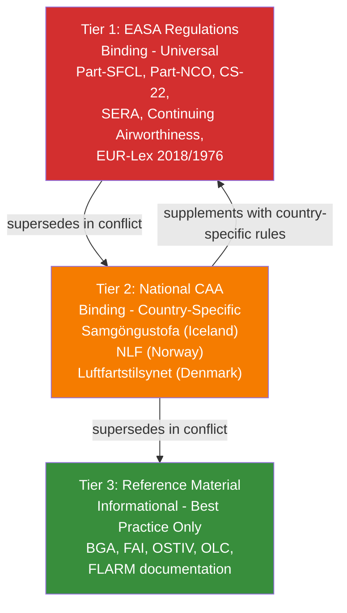
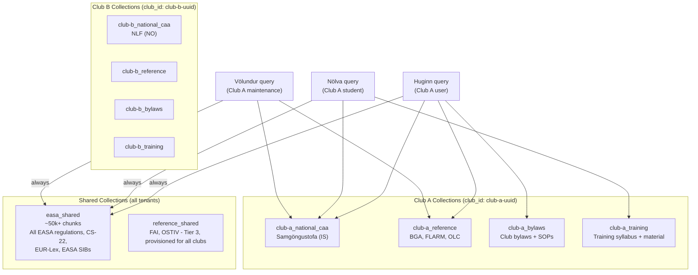
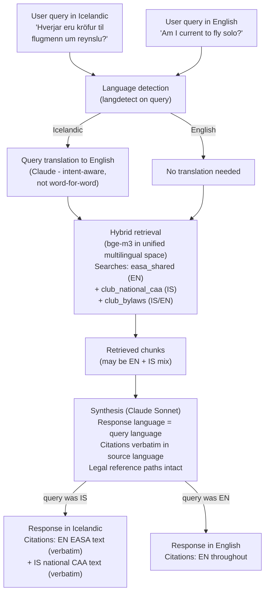
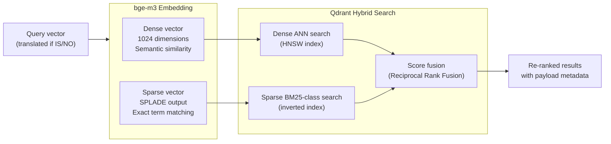

# RAG Strategy

## Overview

Retrieval-Augmented Generation in a regulated domain has different requirements from general-purpose RAG. The primary concern is not semantic recall: It is precision and traceability. A retrieved chunk must carry enough metadata to tell the agent (and the user) exactly which regulation, from which authority, at which tier of the hierarchy, in which language it came from. This shapes every decision in the retrieval architecture.

---

## Three-Tier Regulatory Hierarchy

Every piece of content in the knowledge base is classified at ingestion time by its regulatory status. This classification is stored in chunk metadata and is mandatory in every agent response that cites a source.



| Tier | Source | Status | Agent behaviour |
|---|---|---|---|
| 1 | EASA regulations | Binding - universal | Cited as authoritative; always queried |
| 2 | National CAA (country-specific) | Binding - country-specific | Cited as binding for that club's jurisdiction |
| 3 | Reference material (BGA, FAI, OSTIV, FLARM) | Informational only | Explicitly flagged as non-binding in every citation |

**The critical constraint:** When Tier 3 (BGA guidance) conflicts with Tier 1 (EASA regulation), the agent cites both, identifies the conflict, and defers to Tier 1. It never presents Tier 3 guidance as having binding force.

---

## bge-m3 - Embedding Model Choice

### Why bge-m3, not text-embedding-3-small

The choice of `BAAI/bge-m3` over OpenAI's `text-embedding-3-small` is not primarily about cost or quality on English benchmarks. It is about three properties that are non-negotiable for this platform:

| Property | bge-m3 | text-embedding-3-small |
|---|---|---|
| Multilingual (IS/EN/NO in same vector space) | Native - trained on 100+ languages including Icelandic and Nordic languages | Adequate, but not purpose-built for IS/NO |
| Dense + Sparse in one model | Yes - produces SPLADE sparse vectors alongside dense | Dense only - requires separate BM25 index for hybrid |
| Self-hosted / offline | Yes - runs locally, no API calls during ingestion | API-only - every embedding is an OpenAI API call |
| Legal terminology exact match | Sparse SPLADE vectors provide BM25-class term matching | Requires separate BM25 index |

The sparse vector output is the decisive factor. Legal documents contain terminology - "Part-SFCL.160(a)(1)", "type certificate EASA.A.605", "SERA.5001" - where exact string matching is as important as semantic similarity. bge-m3's SPLADE output handles this natively, in the same embedding call, stored in the same Qdrant point.

Running bge-m3 locally also means zero embedding API cost. The model runs on the processing node during ingestion; on the runtime VM for query-time embedding. The `ANTHROPIC_API_KEY` is used only for Claude reasoning, not for embeddings.

---

## Qdrant Collection Strategy



**Multi-tenant isolation is enforced at two levels simultaneously:**
1. Collection-level: a Club B query never touches Club A's named collections
2. Payload filter: every query includes `club_id` as a mandatory filter on all per-club collections, as a defence-in-depth check

New club onboarding: provision MSSQL tenant → create Qdrant collections (one API call each) → trigger ingestion for national CAA docs, reference material, bylaws → `easa_shared` collection is already available at zero additional cost.

---

## Per-Document-Type Chunking Strategies

One-size-fits-all chunking is explicitly rejected. The `document_type` field in each source manifest entry determines which chunking strategy is applied.

| Document Type | Strategy | Chunk Sizes | Rationale |
|---|---|---|---|
| `regulatory` (EASA, national CAA) | `HierarchicalNodeParser` | 2048 → 512 → 128 tokens | Legal text is hierarchically structured: regulation → article → clause. Parent context needed for correct clause interpretation. |
| `sib` (Safety Information Bulletins) | Dual pipeline: `HierarchicalNodeParser` + LLM structured extraction | 2048 → 512 tokens | Semantic retrieval via chunks; applicability matching via structured fields |
| `training_syllabus` | Semantic / topic-aware `SentenceSplitter` | 512 tokens, 64 overlap | Training material is topic-sequential, not hierarchically legal |
| `bylaws` | `HierarchicalNodeParser` | 1024 → 256 tokens | Similar to regulatory; shorter articles |
| `regulatory_competition` (FAI, OLC) | `HierarchicalNodeParser` | 1024 → 256 tokens | Rule-structured, similar to regulatory |
| `technical` (FLARM, equipment) | Semantic `SentenceSplitter` | 512 tokens, 64 overlap | Procedural / specification text - less hierarchical |

---

## HierarchicalNodeParser + AutoMergingRetriever

The hierarchical approach is the cornerstone of regulatory RAG quality. A flat chunking strategy loses the context that makes a legal clause interpretable.

### The Problem with Flat Chunking

> "SFCL.160(a)(1) The applicant shall have completed not less than 2 hours of flight time as pilot in command of sailplanes."

Retrieved in isolation, this is interpretable. But the surrounding sub-clauses (a)(2), (a)(3), and the parent article SFCL.160 context about "when this requirement applies" are required to answer most real questions correctly. Flat chunking of 512 tokens may or may not include the necessary context. It depends entirely on where the document falls relative to the chunk boundary.

### The Hierarchical Solution

```python
from llama_index.core.node_parser import HierarchicalNodeParser
from llama_index.core.retrievers import AutoMergingRetriever

# Three levels: article (2048) → section (512) → clause (128)
parser = HierarchicalNodeParser.from_defaults(
    chunk_sizes=[2048, 512, 128]
)

# AutoMergingRetriever: if >= 40% of a parent's children match,
# return the parent node instead of individual children
retriever = AutoMergingRetriever(
    vector_store_index,
    storage_context,
    simple_ratio_thresh=0.4,
    verbose=True,
)
```

When a query matches three clause-level (128-token) chunks from the same 512-token section, `AutoMergingRetriever` promotes the response to the section level - returning richer context without expanding the retrieval window for every query. This is context-efficient and precision-aware.

### Parent-Child Relationship in Qdrant

LlamaIndex's `AutoMergingRetriever` requires parent-child chunk relationships to be queryable at retrieval time. With Qdrant as the backend, this relationship is preserved via metadata in each chunk's payload. Every child chunk stores its parent's node ID:

```python
# Child chunk payload example
{
    "node_id": "chunk-sfcl200-a1-128",
    "parent_id": "chunk-sfcl200-a-512",     # points to 512-token parent
    "level": 3,                              # 1=article, 2=section, 3=clause
    "legal_reference_path": "Part-SFCL → Subpart B → SFCL.200 → (a)(1)",
    ...
}
```

At merge time, the retriever fetches the parent node from Qdrant by `parent_id` if the merge threshold is met, replacing the matched children with the richer parent in the context window.

---

## Legal Reference Path in Metadata

Every chunk from a regulatory document carries the full legal reference path in its metadata payload. This is stored in Qdrant as a queryable field and returned with every retrieved chunk.

```python
# Example chunk metadata payload in Qdrant
{
    "source_url": "https://www.easa.europa.eu/en/downloads/94424/en",
    "document_title": "Easy Access Rules for Sailplanes (Part-SFCL)",
    "legal_reference_path": "Part-SFCL → Subpart B → SFCL.200 → (a)(1)",
    "tier": 1,
    "language": "en",
    "document_type": "regulatory",
    "club_id": null,
    "amendment": "Initial Issue",
    "ingestion_date": "2025-01-15T08:30:00Z",
    "checksum": "a3f4b2c1d5e6..."
}
```

When the agent synthesises a response, it formats the citation:

> According to **Part-SFCL → Subpart B → SFCL.200(a)(1)** [EASA - Binding], the requirement for a skill test is...

The user can trace the answer to its exact location in the source document. The citation is not a document title, it is a navigable path.

---

## Multilingual RAG Strategy

The core principle: **translate queries, never documents**.



### Language Detection Fallback

langdetect can struggle with very short queries (2-3 words) in low-resource languages. A short Icelandic query may be misdetected as another language. The fallback strategy:

- If detection confidence is below threshold → assume English and skip translation. The dense vector space handles cross-lingual retrieval even without translation; a minor quality degradation is preferable to a mis-translation.
- If detection returns a language with no translation path (e.g. an unsupported language) → treat as English.
- The detected language is logged per query so detection errors can be identified and the threshold tuned over time.

### Why This Approach

**The authoritative text is the source text.** An Icelandic translation of Part-SFCL is not an EASA regulation. The English text is. When an Icelandic user asks about Part-SFCL requirements, the authoritative answer cites the English source, verbatim, alongside an Icelandic explanation. The user can read the actual regulation.

**bge-m3 crosses language boundaries in the embedding space.** An Icelandic query ("flugmenn með gildandi leyfi") and an English chunk ("pilots holding a valid licence") will produce similar dense vectors. The translation step before retrieval reinforces this - the translated query is semantically closer to the English corpus, improving recall without losing the user's original intent.

**National CAA documents are in the local language for a reason.** Samgöngustofa publishes in Icelandic because Icelandic law is in Icelandic. These documents are indexed in Icelandic and retrieved in Icelandic. The system does not translate them at index time since that would create an unofficial, non-authoritative translation and lose the legal standing of the source text.

---

## Hybrid Search - Dense + Sparse



### Why Hybrid Matters for Legal Documents

**Semantic search alone misses regulatory citations.** "Does SFCL.200 apply here?" A purely semantic search may return documents about pilot requirements that do not contain the exact string "SFCL.200". The sparse vector component catches documents containing the specific article reference.

**Sparse search alone misses intent.** "What are the rules about flying with a student who has never flown before?". This query has no regulatory terminology. Pure BM25 retrieval struggles. The dense vector component captures the semantic intent and retrieves "SFCL.200 - Skill test", "instruction flight requirements", and "first solo" related content correctly.

The combination (with Reciprocal Rank Fusion score merging) outperforms either approach alone across the document corpus. This is particularly evident for queries that mix regulatory terminology with natural language.

---

## Cross-Lingual Retrieval Example

**Query (Icelandic):** *"Þarf ég læknisskoðun til að fljúga seglflug?"*
("Do I need a medical examination to fly gliders?")

**Pipeline:**
1. Language detected: `is` (Icelandic)
2. Query translated to English: *"Is a medical certificate required to fly gliders under SPL?"*
3. bge-m3 encodes translated query → dense + sparse vectors
4. Qdrant searches `easa_shared` + `club_national_caa` + `club_reference`
5. Retrieved chunks include:
   - `Part-SFCL.015` (English): "The holder of an SPL shall hold a valid medical certificate..."
   - `Part-SFCL.160` (English): Recent experience requirements (retrieved by semantic similarity)
   - Samgöngustofa national CAA page (Icelandic): Medical certificate procedures in Iceland
6. Agent synthesises response in Icelandic
7. Citations include verbatim English text from SFCL.015 and verbatim Icelandic from Samgöngustofa

**Response excerpt (Icelandic with citations):**

> Já, samkvæmt **Part-SFCL → SFCL.015** [EASA - Binding]: *"The holder of an SPL shall hold a valid medical certificate issued in accordance with Part-MED."* Samgöngustofa skilgreinir læknisvottorðsferlið fyrir íslenska flugmenn í [Samgöngustofa flugmenn - Binding - IS]: *"Læknisskírteini..."*

The user reads the actual EASA text. They read the actual Samgöngustofa text. The agent's synthesis is the bridge between them - not a paraphrase of either.
