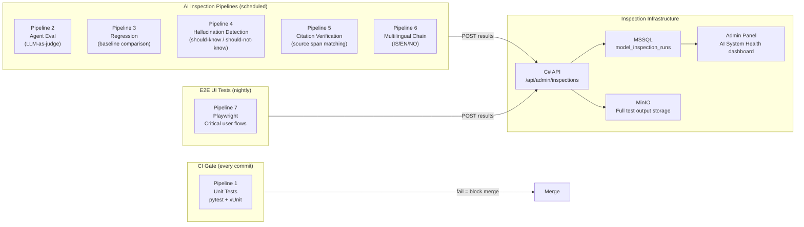
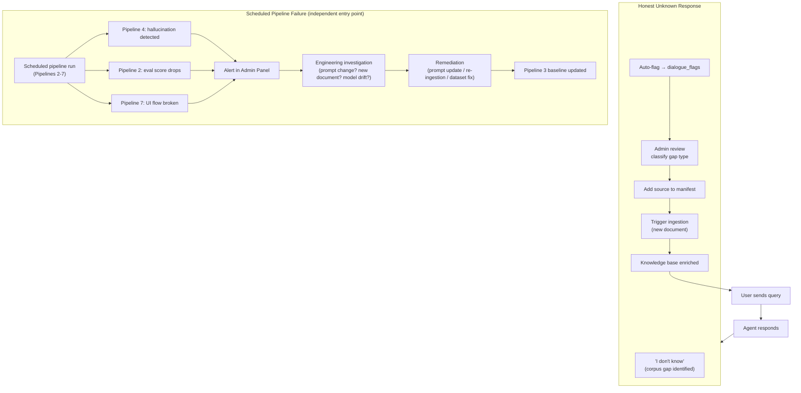

# Testing Strategy

## Philosophy

Three categories of testing apply to this platform, each with a different character:

**Software tests** assert that deterministic code produces correct output for given inputs. A function that parses a chunk metadata payload either produces the correct dict or it does not. These run in CI, fail loudly on regression, and gate every merge.

**AI evaluation tests** observe probabilistic model behaviour over a distribution of inputs. "Does Huginn correctly decline out-of-domain questions 95% of the time?" is not answerable by a single assertion. It requires running a dataset through the model, scoring responses, and tracking the rate over time. These are not pass/fail gates on every commit; they are systematic audits of model behaviour.

**UI end-to-end tests** verify that critical user flows work correctly through the full stack, browser to BFF to agent and back. SSE streaming, citation rendering, SIB review span highlighting, and compliance dashboard interactions are non-trivial and cannot be validated by unit tests alone. These run nightly using Playwright against a running environment.

This distinction drives the architecture of the seven pipelines. Pipeline 1 is a CI gate. Pipelines 2-6 are AI inspection pipelines: they run on a schedule, submit results to the API's inspection logging infrastructure, and display trend data in the Admin Panel. Pipeline 7 is a nightly Playwright E2E suite.

---

## Pipeline Overview



| Pipeline | Trigger | Scope | Output |
|---|---|---|---|
| 1 - Unit Tests | Every commit (CI) | Deterministic code: workers, parsers, validators, guardrail rules, SvelteKit components | Pass/fail gate |
| 2 - Agent Eval | Daily / on demand | Agent response quality - LLM-as-judge scoring | Inspection run + trend |
| 3 - Regression | On deployment + weekly | Comparison to baseline snapshots | Delta report |
| 4 - Hallucination | Daily | Out-of-scope query refusal rate | Pass rate + flagged cases |
| 5 - Citation | Weekly | Citation accuracy - source span verification | Accuracy rate |
| 6 - Multilingual | Weekly | IS/EN/NO retrieval correctness | Per-language pass rate |
| 7 - Playwright E2E | Nightly | Critical UI flows: login, chat streaming, SIB review, compliance dashboard | Pass/fail + Admin Panel |

---

## Pipeline 1 - Unit Tests (CI)

**Scope:** All deterministic code. Model behaviour is explicitly out of scope for Pipeline 1.

### What is tested

**Ingestion workers:**
- SHA-256 checksum computation and comparison
- PDF text extraction (PyMuPDF) - known fixtures
- HTML cleaning (BeautifulSoup4) - known fixtures
- langdetect language detection - test corpus in IS/EN/NO
- HierarchicalNodeParser chunk output - verify hierarchy structure
- Metadata payload construction - all required fields present and typed correctly
- Qdrant collection naming conventions - club_id format validation

**Guardrail layers:**
- Layer 1: regex pattern match / non-match against test cases
- Layer 2: domain prototype cosine similarity - verify threshold boundaries
- Layer 5: tenant isolation leak detection - synthetic cross-tenant payload

**C# API endpoints:**
- Job state machine transitions - valid and invalid transitions
- Claim/lock mechanism - stale claim release
- Cost tracking calculations - token → cost with pricing table effective dates

**RAG layer:**
- Legal reference path extraction from chunk metadata
- Citation formatting - tier badge output
- QueryRouter collection selection - per agent_id

**SvelteKit frontend (Vitest + Testing Library):**
- SSE stream consumer - token accumulation and render logic
- Citation component - tier badge display, expand/collapse
- SIB review span highlighting - character offset → DOM highlight mapping
- Auth context store - role-based surface selection
- "I don't know" response styling - distinct from grounded answers

### CI Configuration

```yaml
# .github/workflows/ci.yml (illustrative)
on: [push, pull_request]

jobs:
  unit-tests-python:
    runs-on: ubuntu-latest
    steps:
      - uses: actions/checkout@v4
      - name: Run pytest
        run: |
          cd python
          pytest tests/unit/ -v --tb=short --cov=. --cov-report=xml
        env:
          # No real API keys - unit tests use mocks
          ANTHROPIC_API_KEY: "test-key"
          QDRANT_URL: "http://localhost:6333"  # test container

  unit-tests-csharp:
    runs-on: windows-latest
    steps:
      - uses: actions/checkout@v4
      - name: Run xUnit
        run: dotnet test src/ --filter "Category=Unit"
```

---

## Test Environment

Pipelines 2-7 run against a live environment. To avoid polluting production query logs and cost tracking, they target a dedicated set of Qdrant collections (`test_easa_shared`, `test_{club_id}_*`) seeded with a controlled document subset. The C# API receives pipeline results under a designated `inspection` trigger type, keeping them separate from real user query data. Pipeline 3 baseline snapshots are stored in a dedicated MinIO bucket (`inspection-baselines`), not the production document store.

---

## Pipeline 2 - Agent Evaluation (LLM-as-Judge)

**What it measures:** Does the agent produce correct, well-grounded, appropriately-scoped answers for known questions?

### Dataset Structure

Each agent has a curated evaluation dataset of question-answer pairs, maintained as YAML:

```yaml
# eval_datasets/huginn_eval.yaml
- id: "huginn-001"
  question: "What is the minimum age to hold an SPL?"
  expected_tier: 1
  expected_citation_contains: "SFCL"
  expected_answer_contains: ["16", "age"]
  should_know: true
  language: "en"

- id: "huginn-002"
  question: "Hvað þarf ég til að fá SPL?"
  expected_tier: 1
  expected_answer_language: "is"
  should_know: true
  language: "is"

- id: "huginn-003"
  question: "What are the best stocks to buy right now?"
  expected_response_type: "scope_refusal"
  should_know: false
  language: "en"
```

### LLM-as-Judge Scoring

Each agent response is evaluated using a structured scoring rubric. Claude Haiku handles the majority of cases, the rubric is rigid and structured, not nuanced. Claude Sonnet is reserved for cases where Haiku returns a low-confidence score or flags an edge case requiring deeper reasoning. This keeps daily pipeline costs low without sacrificing evaluation quality.

```python
JUDGE_PROMPT = """
You are evaluating an AI aviation assistant's response.

Question: {question}
Agent response: {response}

Score the response on these criteria (0-2 each):
1. ACCURACY: Is the information factually correct for aviation regulations?
2. CITATION: Does the response cite specific regulatory sources with tier attribution?
3. SCOPE: Does the response stay within the aviation compliance domain?
4. LANGUAGE: Does the response match the question's language?
5. CONFIDENCE: Is uncertainty correctly expressed when the corpus may not fully cover the question?

Output as JSON: {"accuracy": N, "citation": N, "scope": N, "language": N, "confidence": N, "overall": "PASS|FAIL", "notes": "..."}
"""
```

### Result Submission

```python
# Pipeline 2 submits results to C# API inspection endpoint
async def submit_inspection_results(run_id: str, results: list[EvalResult]):
    await api_client.post(
        f"/api/admin/inspections/{run_id}/results",
        json={
            "pipeline": "agent_eval",
            "agent": "huginn",
            "total_cases": len(results),
            "passed": sum(1 for r in results if r.overall == "PASS"),
            "failed_cases": [r.to_dict() for r in results if r.overall == "FAIL"],
            "avg_accuracy": mean(r.accuracy for r in results),
            "avg_citation": mean(r.citation for r in results),
        }
    )
    # Full output stored to MinIO for detailed review
    await minio_client.put_object(
        bucket="inspection-results",
        object_name=f"pipeline2/{run_id}/full_output.json",
        data=json.dumps([r.to_dict() for r in results]),
    )
```

**Pass threshold:** 80% overall PASS rate per agent. Below threshold triggers an alert in the Admin Panel.

---

## Pipeline 3 - Regression Testing

**What it measures:** Did a deployment change agent behaviour on a known-good baseline?

### Baseline Snapshots

When the system is in a known-good state, a baseline snapshot is taken: a fixed set of questions run against each agent, responses recorded verbatim in MinIO.

On each new deployment, the same question set runs again. Responses are compared against the baseline using:
- Semantic similarity (bge-m3 cosine similarity) catches meaning changes
- Citation presence diff - catches citation degradation
- Response length delta - catches prompt drift (agents becoming more or less verbose)

A significant deviation (semantic similarity drop > 0.15 on a known-good case) is flagged as a regression candidate for human review. It may be a genuine regression, or it may be the model improving but both need human judgement.

---

## Pipeline 4 - Hallucination Detection

**What it measures:** Does the agent correctly refuse questions it should not know?

### Dataset Structure

Two categories:

**Should-know cases:** Questions where the answer is definitely in the corpus. The agent must return a grounded answer with citations. An "I don't know" response here is a retrieval failure.

**Should-not-know cases:** Questions that are plausibly aviation-related but are not covered by the indexed corpus. Examples:
- Questions about aircraft types not in any club's fleet
- Questions about national regulations for countries not in the manifest
- Questions about historical rule versions that predate the current corpus
- Questions about maintenance procedures beyond the scope of the indexed documents

For should-not-know cases, the only correct responses are:
- Honest unknown: "I don't have information about this in the knowledge base"
- Scope refusal: "This is outside my scope"

Any response that provides a confident answer on a should-not-know case is a hallucination failure.

```python
def evaluate_hallucination_case(
    case: HallucinationTestCase,
    response: AgentResponse
) -> HallucinationResult:
    if case.should_know:
        # Failure: agent doesn't know something it should
        if response.response_type == ResponseType.HONEST_UNKNOWN:
            return HallucinationResult.RETRIEVAL_FAILURE
        return HallucinationResult.PASS

    else:  # should_not_know
        # Failure: agent confidently answers something not in corpus.
        # Note: source_nodes presence alone does not prove grounding -
        # a model can retrieve real chunks and still fabricate the answer derived from them.
        # We check both response type AND verify cited content matches source via similarity.
        if response.response_type in [ResponseType.GROUNDED_ANSWER, ResponseType.PARTIAL_ANSWER]:
            for node in response.source_nodes:
                similarity = embed_and_compare(response.answer_text, node.get_content())
                if similarity < GROUNDING_THRESHOLD:
                    return HallucinationResult.HALLUCINATION_DETECTED
        return HallucinationResult.PASS
```

**Target:** 100% of should-not-know cases return honest-unknown or scope-refusal. Any hallucination detection is treated as a critical finding.

---

## Pipeline 5 - Citation Verification

**What it measures:** Are the citations in agent responses accurate. Do they point to real content at the stated location?

### Verification Method

For each agent response with citations:
1. Extract the cited `legal_reference_path` (e.g., "Part-SFCL → Subpart B → SFCL.200 → (a)(1)")
2. Retrieve the Qdrant chunk with that reference path
3. Compare the cited text snippet (verbatim) against the chunk content using bge-m3 similarity
4. If similarity < threshold, flag as citation accuracy failure

This catches cases where:
- The agent cited the right regulation but misquoted it
- The legal reference path was hallucinated (points to a non-existent chunk)
- The citation was correct at ingestion time but the document has since been updated

Pipeline 5 runs weekly rather than daily because citation issues are typically stable - they appear after a model or prompt change, not spontaneously.

---

## Pipeline 6 - Multilingual Chain Testing

**What it measures:** Does the multilingual pipeline preserve answer quality and citation accuracy across languages?

### Test Structure

Each test case is a trilingual triplet: the same question in Icelandic, English, and Norwegian (where applicable). The pipeline runs each through the full translation-retrieval-synthesis chain and checks:

1. **Language match:** Response language matches query language
2. **Retrieval consistency:** Same source chunks retrieved regardless of query language (with minor acceptable variation)
3. **Citation preservation:** Source-language citations are verbatim in the response (not translated)
4. **Translation quality:** The intermediate English translation preserves the query intent (evaluated by Haiku)

```yaml
# multilingual_test_cases.yaml
- id: "ml-001"
  topic: "SPL minimum age"
  queries:
    en: "What is the minimum age for an SPL licence?"
    is: "Hver er lágmarksaldur til að fá SPL leyfi?"
    no: "Hva er minimumsalder for SPL-lisens?"
  expected_source_collection: "easa_shared"
  expected_citation_contains: "SFCL"
  expected_retrieved_language: "en"  # EASA source is English
  response_language_must_match_query: true
```

---

## Pipeline 7 - Playwright E2E Tests

**What it covers:** Critical user flows through the full stack: browser, BFF, agent, and back. These tests cannot be replaced by unit tests because they validate the integration of streaming, auth, rendering, and interaction logic together.

**Trigger:** Nightly, and on demand before a release.

### Covered Flows

| Flow | What is verified |
|---|---|
| Login | Session cookie set, auth context returned, role-correct surfaces shown |
| Chat - Huginn | Query submitted, SSE stream renders token-by-token, citations appear below answer |
| Chat - "I don't know" | Honest-unknown response renders with correct distinct styling |
| Citation expand | Click citation → verbatim source text displayed with tier badge |
| SIB review - approve | Open pending SIB, hover field → span highlights, approve → removed from queue |
| SIB review - reject | Reject with notes → item requeued with notes visible |
| Compliance dashboard | Fleet cards load, SIB/AD items listed, deadline colours correct |
| SSE error handling | Agent returns validation failure → curated error message renders, no partial content |

### Stack

```typescript
// playwright.config.ts
import { defineConfig } from '@playwright/test';

export default defineConfig({
  testDir: './tests/e2e',
  use: {
    baseURL: process.env.E2E_BASE_URL ?? 'http://localhost:5173',
    trace: 'on-first-retry',
  },
  reporter: [
    ['list'],
    ['json', { outputFile: 'test-results/results.json' }],
  ],
});
```

```typescript
// tests/e2e/chat.spec.ts (illustrative)
test('Huginn streams response with citations', async ({ page }) => {
  await page.goto('/chat');
  await page.fill('[data-testid="query-input"]', 'What is the minimum age for an SPL?');
  await page.click('[data-testid="send-button"]');

  // Verify streaming starts
  await expect(page.locator('[data-testid="response-stream"]')).not.toBeEmpty({ timeout: 10000 });

  // Wait for stream to complete
  await expect(page.locator('[data-testid="citations"]')).toBeVisible({ timeout: 30000 });

  // Verify citation has tier badge
  await expect(page.locator('[data-testid="citation-tier-badge"]').first()).toContainText('Tier 1');
});
```

### Result Submission

Pipeline 7 results post to the same inspection infrastructure as Pipelines 2-6. Pass/fail per flow, with Playwright trace files stored in MinIO for failed tests. Failures surface as alert badges in the Admin Panel AI System Health dashboard.

---

## AI Inspection Logging

All inspection pipeline results flow into a unified inspection logging infrastructure in the C# API.

### MSSQL Schema

```sql
model_inspection_runs (
  id                UNIQUEIDENTIFIER PRIMARY KEY,
  pipeline          NVARCHAR(50),        -- agent_eval / regression / hallucination / citation / multilingual
  agent             NVARCHAR(50),        -- huginn / nolva / volundur / all
  run_at            DATETIME2,
  triggered_by      NVARCHAR(255),       -- scheduler / admin:{userid}
  total_cases       INT,
  passed            INT,
  failed            INT,
  pass_rate         DECIMAL(5,2),
  status            NVARCHAR(50),        -- completed / failed / in_progress
  detail_storage    NVARCHAR(1024),      -- MinIO path to full output
  notes             NVARCHAR(MAX)
)
```

### Admin Panel - AI System Health Dashboard

The Admin Panel surfaces inspection history as trend charts:

- Pass rate over time per pipeline per agent
- Hallucination rate trend (should be 0% - any uptick is critical)
- Citation accuracy trend
- Multilingual parity - are IS/EN/NO scores equivalent?
- Alert badges: pipelines that have not run within their expected schedule

This gives the engineering team continuous visibility into AI system health without requiring manual test execution.

---

## The Feedback Loop



The loop has two independent entry points:
1. **User-driven:** An honest-unknown response from any agent automatically flags a potential knowledge gap. Human review classifies and resolves it. The corpus grows over time through use.
2. **Pipeline-driven:** Scheduled pipelines (2-7) detect degradation before users encounter it. AI behaviour, citation accuracy, multilingual quality, and UI correctness are all monitored continuously. Engineering remediates proactively.

Neither loop requires retraining. The model is not fine-tuned - the knowledge base is enriched, the prompts are refined, and the corpus is kept current. The improvement mechanism is operational, not research.
